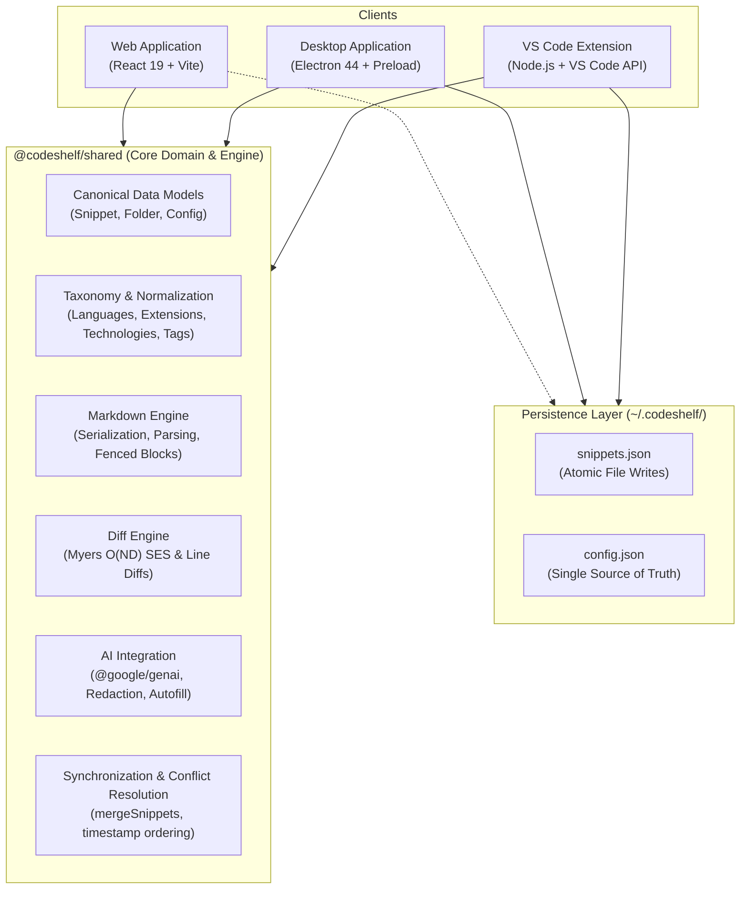
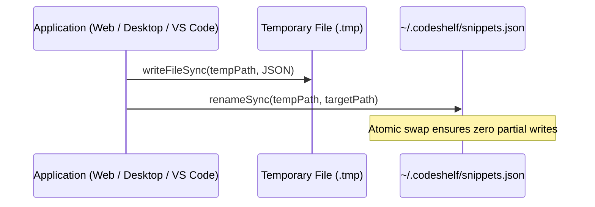

# CodeShelf Architecture Guide

This document provides a comprehensive technical overview of **CodeShelf's** system architecture, data models, persistence strategies, multi-client integrations, and security design.

---

## 1. High-Level System Architecture

CodeShelf is organized as a unified monorepo powered by **pnpm workspaces** and **TypeScript**. Business logic, data models, diff engines, and normalization systems are centralized in `@codeshelf/shared`, ensuring deterministic, identical behavior across the Web, Desktop, and IDE environments.



---

## 2. Monorepo Structure

```text
codeshelf/
├── apps/
│   ├── desktop/             # Electron shell (main, preload, services, windowManager)
│   ├── vscode/              # VS Code extension (capture, search, explorer, updates)
│   └── web/                 # React 19 web app (layout, editor, viewers, search, modals)
├── packages/
│   └── shared/              # Shared domain engine, types, validators, algorithms & tests
├── .github/
│   └── workflows/           # CI validation and multi-platform release pipelines
├── docs/
│   ├── ARCHITECTURE.md      # System architecture specification
│   ├── BENCHMARKS.md        # Official performance & micro-benchmark reports
│   ├── CHANGELOG.md         # Project change log & release history
│   ├── CONTRIBUTING.md      # Developer contribution guidelines
│   ├── CROSS-PLATFORM.md    # Multi-environment capabilities and constraints
│   ├── DEVELOPMENT.md       # Local development setup and contribution workflow
│   ├── EXTENSION.md         # VS Code extension architecture and commands
│   ├── INSTALLATION.md      # Installation and build instructions
│   ├── RELEASES.md          # Release matrix, packaging, and distribution
│   ├── SEARCH.md            # Search pipeline, tokenization, and ranking
│   ├── STORAGE.md           # Filesystem layout, atomic writes, and sync
│   └── USAGE.md             # End-user workflows and commands
└── README.md                # Project landing documentation
```

### Separation of Concerns
1. **`@codeshelf/shared`**: Zero DOM or Electron dependencies. Contains domain models, Myers diff algorithm, SHA-256 content hashing, markdown parsing/serialization, and canonical taxonomy matching.
2. **`apps/desktop`**: Electron main process and secure context-isolated preload bridge. Exposes safe file access and update APIs via `window.codeshelfApi`.
3. **`apps/web`**: Single-page application using Tailwind CSS and Lucide icons. Runs standalone in the browser (using the File System Access API) or embedded within Electron.
4. **`apps/vscode`**: Native extension integrating directly into developer editing sessions via the VS Code Extension API.

---

## 3. Data Model & Taxonomy

### The Canonical Snippet Model

Every snippet in CodeShelf adheres to a single canonical schema:

```typescript
export interface Snippet {
  id: string;                     // Unique identifier (e.g. snip-1718000000000)
  title: string;                  // Snippet title
  description?: string;           // Optional summary or What/Why/When/How notes
  code: string;                   // Primary source code
  language: string;               // Canonical lowercase identifier (e.g. 'typescript', 'cpp')
  category?: string;              // High-level classification
  folder?: string;                // Organizational hierarchy folder
  subcategory?: string;           // Sub-classification
  tags: string[];                 // Normalized lowercase tags (deduplicated)
  technology?: string[];          // Canonical technology names (e.g. ['TypeScript', 'React'])
  usage?: string[];               // Usage contexts
  complexity?: {
    time?: string;                // Time complexity (e.g. 'O(log n)')
    space?: string;               // Space complexity (e.g. 'O(1)')
  };
  version?: number;               // Monotonic version counter
  history?: SnippetRevision[];    // Revision snapshots and Myers diffs
  markdown?: string;              // Optional raw Markdown document source
  codeBlocks?: SnippetCodeBlock[];// Multiple fenced code blocks in document
  hash?: string;                  // Deterministic content hash
  createdAt: string;              // ISO 8601 timestamp
  updatedAt: string;              // ISO 8601 timestamp
}
```

### Distinct Organizational Concepts
To avoid confusing overlapping metadata, CodeShelf establishes strict boundaries:
- **Folder**: Represents the user's navigational hierarchy (filesystem-like tree).
- **Category**: Represents a classification domain (e.g., Algorithms, Frontend, Backend).
- **Technology**: Represents frameworks, libraries, or runtimes (e.g., React, Node.js, PyTorch).
- **Language**: Derived and normalized lowercase identifier (e.g., `typescript`, `cpp`, `python`).
- **File Extension**: Dotted format (e.g., `.ts`, `.cpp`) mapping to canonical languages.

### Centralized Case-Insensitive Normalization

All language, technology, and extension matching is normalized in `@codeshelf/shared`:

```typescript
normalizeTechnology('typescript') // -> 'TypeScript'
normalizeTechnology('.CPP')       // -> 'C++'
normalizeLanguage('.TS')          // -> 'typescript'
normalizeLanguage('C++')          // -> 'cpp'
normalizeExtension('tS')          // -> '.ts'
normalizeTag('#React')            // -> 'react'
```

---

## 4. Storage & Persistence Architecture

### Single Source of Truth (`~/.codeshelf/`)
CodeShelf eliminates volatile browser memory or isolated extension states in favor of a unified local directory:
- `~/.codeshelf/snippets.json`: Complete snippet database.
- `~/.codeshelf/config.json`: Configuration and preferences.

### Atomic File Writes & Race Condition Prevention
To prevent data loss or file corruption during simultaneous edits or system crashes:
1. Data is written to a temporary sibling file: `~/.codeshelf/.snippets.<timestamp>.<rand>.tmp`.
2. The file is flushed to disk and atomically renamed over `snippets.json`.
3. On Windows file locks, an automated retry mechanism replaces the target cleanly.
4. **Conflict Resolution (`mergeSnippets`)**: When merging concurrent writes, timestamps (`updatedAt`) determine the canonical version, and revision histories are merged without duplicates.



---

## 5. Visual Diff Engine (Myers SES)

CodeShelf includes an in-house implementation of **Eugene W. Myers' $O(ND)$ Difference Algorithm (1986)**:
- Operates along diagonals $k = x - y$ to compute the **Shortest Edit Script (SES)**.
- Accurately reports `added`, `removed`, and `unchanged` lines.
- Computes diff metrics across commits and snapshot rollbacks.
- Operates in microsecond latency (>50,000 full diffs/second).

---

## 6. AI Integration Architecture

CodeShelf integrates Google Gemini through `@google/genai` with strict safety boundaries:
1. **Zero-Dependency Mandate**: The core application functions 100% offline without an API key.
2. **Key Security**: API keys are stored exclusively in `~/.codeshelf/config.json` (filesystem) or runtime memory—**never** in browser `localStorage`.
3. **Response Validation**: AI outputs are validated against internal schemas before being merged into snippets.
4. **Secret Redaction**: Error handlers automatically mask and strip potential API keys from error outputs.

---

## 7. Client Architectures

### Desktop Application (Electron)
- **Security Baseline**: `contextIsolation: true`, `nodeIntegration: false`, `sandbox: false` with restricted preload bridge.
- **Single Instance**: Protected via `app.requestSingleInstanceLock()`.
- **Navigation Safety**: `will-navigate` event prevents loading arbitrary web URLs inside the application window. External links are delegated to `shell.openExternal`.
- **Path Verification**: `LAUNCH_INSTALLER` IPC handler strictly validates that binaries reside inside the user's Downloads folder.

### Web Application (React + Vite)
- **Local File System Access API**: Connects directly to `~/.codeshelf/` on Chromium browsers.
- **Vite Storage Bridge**: During local development (`pnpm run web:dev`), a Vite server middleware watches `~/.codeshelf/` and broadcasts HMR updates to the browser.
- **Multi-Tab Sync**: Uses `BroadcastChannel` to keep open tabs synchronized in real time.

### Visual Studio Code Extension
- **Non-blocking Workflows**: Captures code, searches snippets, and inserts templates directly via VS Code QuickPicks without opening webviews.
- **Atomic Deletions**: Deletes bypass merging to ensure removed items are permanently deleted across shared files.
- **Tree Provider**: Hierarchically organizes snippets by folder and category in the sidebar explorer.
