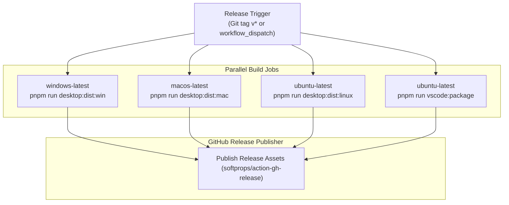

# Release & Distribution Pipeline

This document details the build, packaging, release automation, and distribution processes for CodeShelf desktop applications and the VS Code extension.

## Release Triggers & Workflow

Release automation is managed via GitHub Actions in [`.github/workflows/release.yml`](../.github/workflows/release.yml).

### Triggers
1. **Git Tag Push**: Pushing a tag matching `v*` (e.g., `git push origin v0.3.3`).
2. **Manual Dispatch**: Using GitHub's `workflow_dispatch` interface with an optional `tag_name` input parameter.

---

## Release Matrix & Artifacts

The release pipeline executes across a matrix of operating system runners:

### Artifact Manifest

| Target Platform | Package Format | File Pattern | Generated By |
|---|---|---|---|
| **Windows** | NSIS Installer | `CodeShelf.Setup.<version>.exe` | `electron-builder --win` |
| **Windows** | Portable Executable | `CodeShelf.<version>.exe` | `electron-builder --win` |
| **macOS** | Disk Image (DMG) | `CodeShelf-<version>-arm64.dmg` | `electron-builder --mac` |
| **macOS** | Zip Archive | `CodeShelf-<version>-mac.zip` | `electron-builder --mac` |
| **Linux** | AppImage | `CodeShelf-<version>.AppImage` | `electron-builder --linux` |
| **Linux** | Debian Package | `codeshelf-desktop_<version>_amd64.deb` | `electron-builder --linux` |
| **VS Code** | VSIX Extension | `codeshelf-<version>.vsix` | `@vscode/vsce package --no-dependencies` |

---

## Extension Marketplace Distribution

The `build-vscode` job also supports automated marketplace publishing if respective secrets are configured in the repository:

- **VS Code Marketplace**: Published via `vsce publish` if `secrets.VSCE_PAT` is provided.
- **Open VSX Registry**: Published via `npx ovsx publish` if `secrets.OVSX_PAT` is provided.

---

## In-App Auto-Update Checking

Both the Desktop application and the VS Code extension check GitHub releases for available updates:

1. **Endpoint**: Queries `GET https://api.github.com/repos/sagarkrjha/codeshelf/releases/latest`.
2. **Version Comparison**: Compares the GitHub release tag against the current application version using `isNewerVersion(remote, local)` in `@codeshelf/shared`.
3. **Desktop Downloads**:
   - Downloads the platform installer asset directly to the user's Downloads directory.
   - Reports download progress to the UI.
   - Can launch the installer via `shell.openPath` or gracefully quit and trigger installer execution with `/S` (Windows) or `open` (macOS).
4. **Extension Updates**:
   - Downloads the latest `.vsix` asset to temporary storage.
   - Executes `workbench.extensions.installExtension` to update the extension.
   - Prompts the user to reload the editor window.
