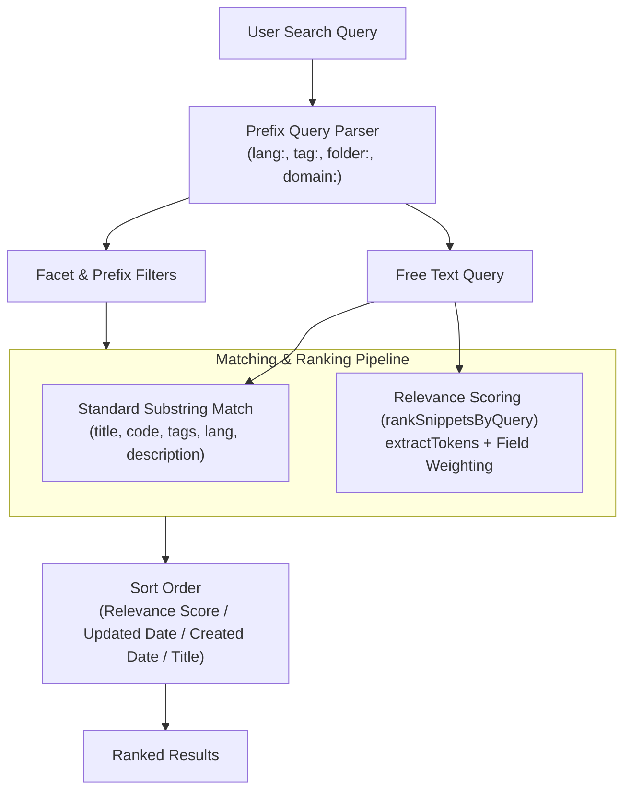

# Search & Matching Implementation

This document describes the search pipeline, tokenization, similarity algorithms, and ranking mechanics implemented in CodeShelf.

## Search Pipeline Overview

Search in CodeShelf is implemented in `@codeshelf/shared` and consumed across the Web, Desktop, and VS Code extension clients.



---

## Query Prefix Parsing

The search engine allows combining free text with query prefix tokens:

| Prefix | Syntax Example | Description |
|---|---|---|
| `lang:` | `lang:typescript` | Matches the snippet's canonical programming language. |
| `tag:` | `tag:react` | Matches normalized tags. |
| `folder:` | `folder:algorithms` | Matches folder or category hierarchy. |
| `domain:` | `domain:frontend` | Matches category or classification domain. |

The parser strips extracted prefixes and passes the remaining terms to the free-text matcher or relevance scoring engine.

---

## Tokenization

The `extractTokens` function ([`packages/shared/src/features/similarity/similarity.ts`](../packages/shared/src/features/similarity/similarity.ts)) normalizes strings into token sets:

```typescript
export function extractTokens(text: string): Set<string> {
  const words = text
    .toLowerCase()
    .replace(/[^\w\s-]/g, ' ')
    .split(/\s+/)
    .filter((w) => w.length > 1);
  return new Set(words);
}
```

- Converts input to lowercase.
- Replaces non-alphanumeric characters (excluding hyphens) with spaces.
- Splits on whitespace.
- Drops single-character tokens to reduce noise.

---

## Jaccard Similarity

Token overlap is computed using the Jaccard similarity coefficient:

$$J(A, B) = \frac{|A \cap B|}{|A \cup B|}$$

```typescript
export function jaccardSimilarity(setA: Set<string>, setB: Set<string>): number {
  if (setA.size === 0 && setB.size === 0) return 0;
  let intersection = 0;
  for (const item of setA) {
    if (setB.has(item)) intersection++;
  }
  const union = setA.size + setB.size - intersection;
  return union === 0 ? 0 : intersection / union;
}
```

---

## Relevance Scoring (`rankSnippetsByQuery`)

When "Semantic Ranking" is enabled, CodeShelf performs weighted lexical matching across snippet fields:

$$\text{Score} = \sum_{t \in Q} \Big( 5.0 \cdot \mathbb{I}(t \in T_{\text{title}}) + 4.0 \cdot \mathbb{I}(t \in T_{\text{tags}}) + 3.0 \cdot \mathbb{I}(t \in T_{\text{meta}}) + 2.0 \cdot \mathbb{I}(t \in T_{\text{desc}}) + 1.0 \cdot \mathbb{I}(t \in T_{\text{code}}) \Big)$$

| Snippet Field | Token Weight | Rationale |
|---|---|---|
| **Title** | `5.0` | Exact topic match in the title indicates highest intent. |
| **Tags** | `4.0` | Explicit categorization tags represent curated intent. |
| **Metadata** (Lang / Tech / Category) | `3.0` | Technology and classification alignment. |
| **Description** | `2.0` | Explanatory context. |
| **Code** | `1.0` | Code tokens can be noisy, so lower weight prevents false positives. |

Snippets with a score greater than `0` are returned, sorted in descending order of relevance.

> [!NOTE]
> In CodeShelf, "semantic search" refers to weighted token and metadata relevance scoring with canonical taxonomy awareness, rather than vector-embedding neural search.

---

## Related Snippets Recommendation (`computeSnippetSimilarity`)

To recommend related snippets when viewing a snippet, CodeShelf calculates multi-dimensional similarity:

$$\text{Similarity}(A, B) = 0.30 \cdot S_{\text{domain}} + 0.25 \cdot S_{\text{tech}} + 0.30 \cdot S_{\text{tags}} + 0.15 \cdot S_{\text{tokens}}$$

- **Domain Score ($30\%$)**: `1.0` if categories match; `1.2` if both category and subcategory match.
- **Tech Score ($25\%$)**: Jaccard similarity across technologies and programming language.
- **Tag Score ($30\%$)**: Jaccard similarity across normalized tags.
- **Token Score ($15\%$)**: Jaccard similarity between title and code tokens (first 300 characters).

The `findRelatedSnippets` function filters matches with similarity $> 0.05$ and returns the top $N$ (default: 3).

---

## Benchmark Observations

Micro-benchmarks executed in `@codeshelf/shared` (`pnpm bench`) measure search operations under local test environments:

- **Token Extraction & Jaccard Similarity**: Evaluated across string pairs (`extractTokens` + `jaccardSimilarity`). Local test runs demonstrate ~200,000–280,000 operations/sec.
- **Query Ranking**: Evaluated over a synthetic collection of 50 snippets. Local test runs demonstrate ~850–1,100 query evaluations/sec (~0.9–1.2 ms per query over 50 snippets).

*Note: Benchmark throughput depends on CPU hardware, Node.js version, and snippet collection size.*
