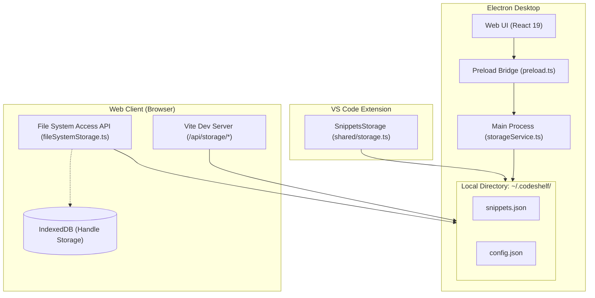
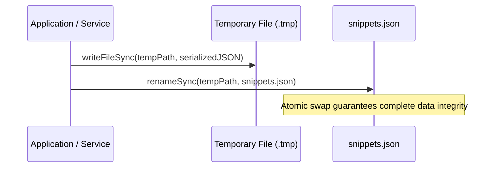

# Persistence & Storage Architecture

This document details the persistence architecture, filesystem layout, atomic file write strategies, and synchronization mechanisms used across CodeShelf environments.

## Storage Hierarchy

CodeShelf uses the local filesystem directory `~/.codeshelf` as the single source of truth for both snippets and configuration.

```text
~/.codeshelf/
├── snippets.json    # Primary snippet database (JSON array of Snippet objects)
└── config.json      # Single source of truth for settings, preferences, and permissions
```

---

## Environment Implementations

Different client platforms interface with `~/.codeshelf` according to their runtime capabilities:



### 1. Desktop Application (Electron)

- **Access Method**: Direct Node.js `node:fs` calls inside the Electron main process (`apps/desktop/electron/services/storageService.ts`).
- **Preload Bridge**: Synchronous (`sendSync`) and asynchronous (`invoke`) IPC channels expose methods (`getSnippets`, `saveSnippets`, `getConfig`, `saveConfig`) via `window.codeshelfApi`.
- **File Watching**: An external watcher service (`watcherService.ts`) monitors `~/.codeshelf/` for changes made by external tools (such as VS Code) and pushes `snippets-changed` and `config-changed` events to the renderer.

### 2. VS Code Extension

- **Access Method**: Direct Node.js `node:fs` operations (`apps/vscode/src/shared/storage.ts`).
- **File Watching**: Watches `~/.codeshelf/` with `fs.watch` to detect changes written by the Desktop or Web apps, refreshing the Activity Bar tree view when updates occur.

### 3. Web Application (Standalone Browser)

- **File System Access API**: Uses `window.showDirectoryPicker` to allow users to select or connect their `~/.codeshelf` directory directly.
- **Directory Handle Persistence**: Browser directory handles cannot be stored in cookies or localStorage; CodeShelf persists the `FileSystemDirectoryHandle` inside IndexedDB (`codeshelf-fs` database, `handles` object store).
- **In-Memory Cache**: Maintains an in-memory cache synchronized with the disk files.
- **Multi-Tab Synchronization**: Uses `BroadcastChannel('codeshelf_sync_channel')` to reflect updates across open browser tabs immediately.

### 4. Web Application (Local Development Server)

- When running the web development server (`pnpm run web:dev`), Vite includes custom middleware (`viteStorageSyncPlugin.ts`) mounted at `/api/storage/snippets` and `/api/storage/config`.
- Reads and writes to `~/.codeshelf/` on the host machine and broadcasts file modifications to the browser over Vite's HMR WebSocket.

---

## Atomic Write Strategy

To prevent file corruption from partial writes during application crashes or sudden system shutdowns, CodeShelf enforces an atomic write routine:



1. Data is written to a temporary sibling file:
   ```text
   ~/.codeshelf/.snippets.<timestamp>.<random-id>.tmp
   ```
2. The file is flushed to disk.
3. The temporary file is renamed atomically over `snippets.json` using `fs.renameSync`.
4. **Windows File Lock Recovery**: If Windows briefly locks the target file during rename, the storage service catches the exception, unlinks the target if necessary, and completes the rename.

---

## Conflict Resolution & Merging (`mergeSnippets`)

When concurrent writes occur across different clients, CodeShelf resolves conflicts deterministically in [`packages/shared/src/features/sync/sync.ts`](../packages/shared/src/features/sync/sync.ts):

- **Timestamp Precedence**: If two instances update the same snippet ID, the snippet with the newer `updatedAt` ISO 8601 timestamp is kept.
- **Revision History Merging**: The revision history arrays of both snippets are merged and deduplicated by revision version, ensuring historical commits are preserved.
- **Deletion Handling (`skipMerge`)**: Deletions bypass union-merging so removed snippets are not resurrected from disk caches.
